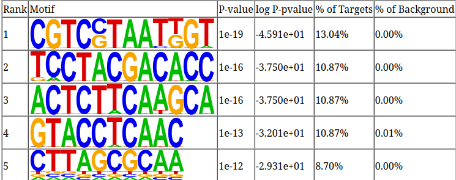

```{r setup, include=T, message=F}
#root.dir <- here::here()
knitr::opts_chunk$set(
  collapse = TRUE,
  comment = "#>",
  #root.dir = root.dir
  fig.height = 6,
  fig.width = 7.00787 #178mm
)  
knitr::opts_knit$set(#root.dir = root.dir, 
                     dpi = 350)  
library(data.table)
library(ggplot2)
library(tidyverse)
library(cowplot)
library(MEDIPS)
library(DiffBind)
library(BSgenome)
library(Rsamtools)
library(edgeR)
library(gtools)
library(DNAcopy)
library(rtracklayer)
library(viridis)
library(dplyr)
library(genomation)
library(biomaRt)
library(GenomicRanges)
library(DT)
library(magick)
library(patchwork)
library(slickR)
library(svglite)
#library(ggpubr)
```


## Calculation of Differentially methylated regions
The first step is to generate peaks using MACS2 for Wild type and TAYN-mutant MBDCapSeq and for hMe/MeDipSeq data. I then generate consensus peaks following the code from [here](https://ro-che.info/articles/2018-07-11-chip-seq-consensus).

Next, the package MEDIPS was used to find differentially methylated regions between wild type and TAYNCapseq. However, the number of enriched regions betweeen Wildtpye and TAYN differ a lot due to the difference in the depth of coverage between them


Therefore, the DMRs detected are biased towards the peaks from TAYNCap. To account for this bias, I generated consensus peaks the WT and TAYNCapSeq data same with the same criteria as DipSeq data and then intersected these consensus peaks with the DMRs detected by MEDIPS. using these criteria we obtain peaks which are present in both WT and TAYNCap however, they are more enriched in the TAYN compared to the WT data. Further, these regions are intersected with the consensus peaks from Dipseq to finally give us the desired regions. Here is a short summary of the number of peaks:
1. TAYN and WT consensus peak: 5898peaks
2. hMeDip and MeDip consensus peak: 78802peaks
3. DMRs from MEDIPS: 12521peaks
4. DMRs intersected with TAYN and WT consensus(MBDSeq consensus)peaks: 1229peaks
5. DMRs intersected with MBDSeq and DipSeq consensus peaks: 200peaks
6. DMRs intersected with only DipSeq consensus peaks: 2227peaks


## Annotating the peak regions
I used the annotatePeaks tool from `homer` to annotate the enriched regions and then used Rscript to generate the plots. To annotate the location of a given peak in terms of important genomic features, annotatePeaks.pl calls a separate program (assignGenomeAnnotation) to efficiently assign peaks to one of millions of possible annotations genome wide. Two types of output are provided. The first is "Basic Annotation" that includes whether a peak is in the TSS (transcription start site), TTS (transcription termination site), Exon (Coding), 5' UTR Exon, 3' UTR Exon, Intronic, or Intergenic, which are common annotations that many researchers are interested in. A second round of "Detailed Annotation" also includes more detailed annotation, also considering repeat elements and CpG islands. Since some annotation overlap, a priority is assign based on the following (in case of ties it's random [i.e. if there are two overlapping repeat element annotations]): TSS (by default defined from -1kb to +100bp) TTS (by default defined from -100 bp to +1kb) CDS Exons 5' UTR Exons 3' UTR Exons *CpG Islands *Repeats Introns Intergenic ** Only applicable for the "Detailed Annotation".

### DMRs intersected with MBDSeq and DipSeq consensus peaks

```{r, echo=FALSE, out.width="49%", fig.align='center',fig.show='hold',fig.cap="DMRs intersected with DipSeq and CapSeq consensus peaks"}
knitr::include_graphics(c("Images/Annotate/lower_level_1.png","Images/Annotate/upper_level_1.png"))
#knitr::include_graphics("~/Pictures/RBPFOX2.png")
```
This shows that most of the detected enriched regions are classified as intergenic and introns, on further detailed annotation LTRs and Simple_repeat regions.

And the top motifs for these enriched regions are

```{r, echo=FALSE, fig.align='center', fig.show='hold'}

```

Along with the CA and CG oligos account for 9.11% and 4.79% of the total reads in the peaks. I am working on a script to calculate this percentage for each of the peaks as well. I further calculated the percentage of CA and CG oligos in each of the peaks regions

```{r, echo=FALSE}
df <- data.table(fread("DMR_sequences.tsv"))
DT::datatable(df[,c(1,3,4,2)], options = list(scrollX=TRUE))

```


A majority of the 200 peaks (TAYN > wt, meDIP & hMeDIP positive) are located in repeat regions and we are interested in seeing if this changes when we just consider the Cap data because repetitive regions can be artificially enriched in the DIP samples.


```{r, out.width="49%", echo=FALSE, fig.show='hold', fig.cap="DMRs intersected with Dip consensus peaks only", fig.align='center'}
knitr::include_graphics(c("Images/Annotate/DMR_onlyMBD/upper_level_tot.png","Images/Annotate/DMR_onlyMBD/lower_level_tot.png"))
```


### DMRs intersected with TAYN positive and WT negative regions

To get the TAYN positive and WT negative regions I used the consensus peaks for MethylCap and TAYNCap. There are a total of 8352 consensus peaks for MethylCap and 83672 consensus peaks for TAYNCap. Inorder to get the TAYN positive and WT negative regions, I subtracted the WT peaks from the TAYN consensus peaks and we end up with a total of 77936 peaks. I then intersected these peaks with the differentially methylated regions detected by MEDIPS and we get a total of 9418 peaks/regions. Further these regions were annotated using homer


```{r, echo=FALSE, out.width="49%", fig.show='hold',fig.align='center',fig.cap="DMRs interseceted with TAYN positive and WT negative regions"}
knitr::include_graphics(c("Images/Annotate/DMR_onlyTAYN/upper_level_tot.png","Images/Annotate/DMR_onlyTAYN/lower_level_tot.png"))
```


These regions are intersected with the consensus peaks from DipSeq and then performed the annotation of the regions 


```{r, echo=FALSE, out.width="49%", fig.show='hold', fig.align='center',fig.cap="DMRs intersected with TAYN positive and DipSeq consensus peaks"}
knitr::include_graphics(c("Images/Annotate/DMR_TAYN_with_Dip/upper_level_tot.png", "Images/Annotate/DMR_TAYN_with_Dip/lower_level_tot.png"))

```


## Annotation of MethylSeq Peaks

```{r, echo=FALSE, out.width="49%"}
knitr::include_graphics(c("Images/Annotate/Methyl/upper_level_tot.png","Images/Annotate/Methyl/lower_level_tot.png"))
```

## Annotation of TAYNCapSeq peaks

```{r, echo=FALSE, out.width="49%"}
knitr::include_graphics(c("Images/Annotate/TAYN/upper_level_tot.png", "Images/Annotate/TAYN/lower_level_tot.png"))
```


## Annotation of MeDipSeq peaks

```{r, echo=FALSE, out.width="49%"}
knitr::include_graphics(c("Images/Annotate/MeDip/upper_level_tot.png","Images/Annotate/MeDip/lower_level_tot.png"))
```


## Annotation of hMeDipSeq peaks

```{r, echo=FALSE, out.width="49%"}
knitr::include_graphics(c("Images/Annotate/hMeDip/upper_level_tot.png", "Images/Annotate/hMeDip/lower_level_tot.png"))

```

