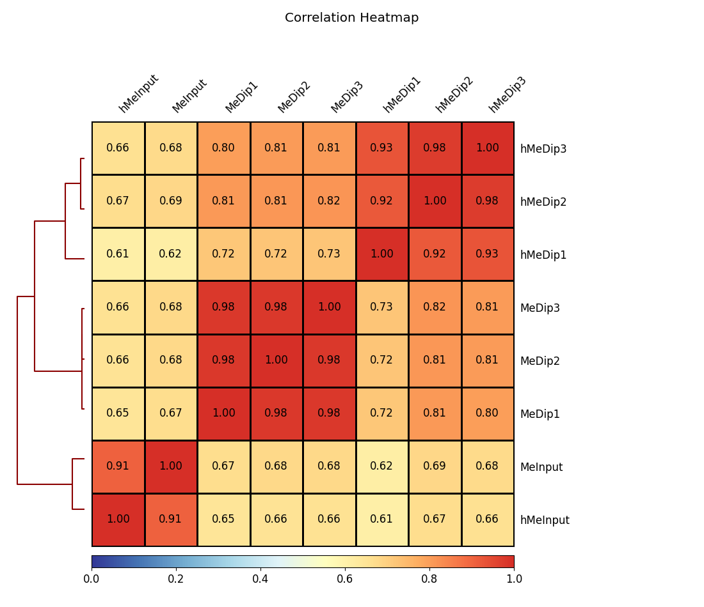
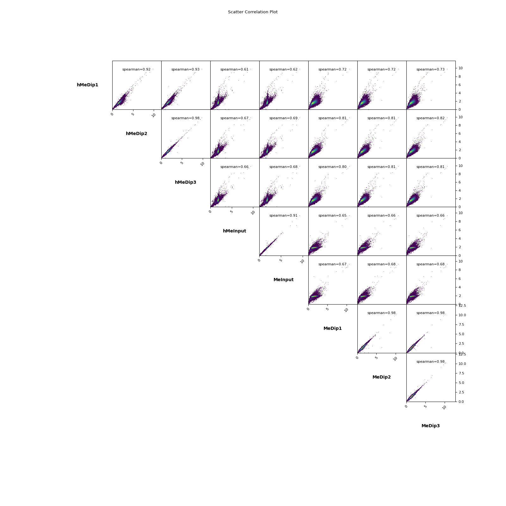
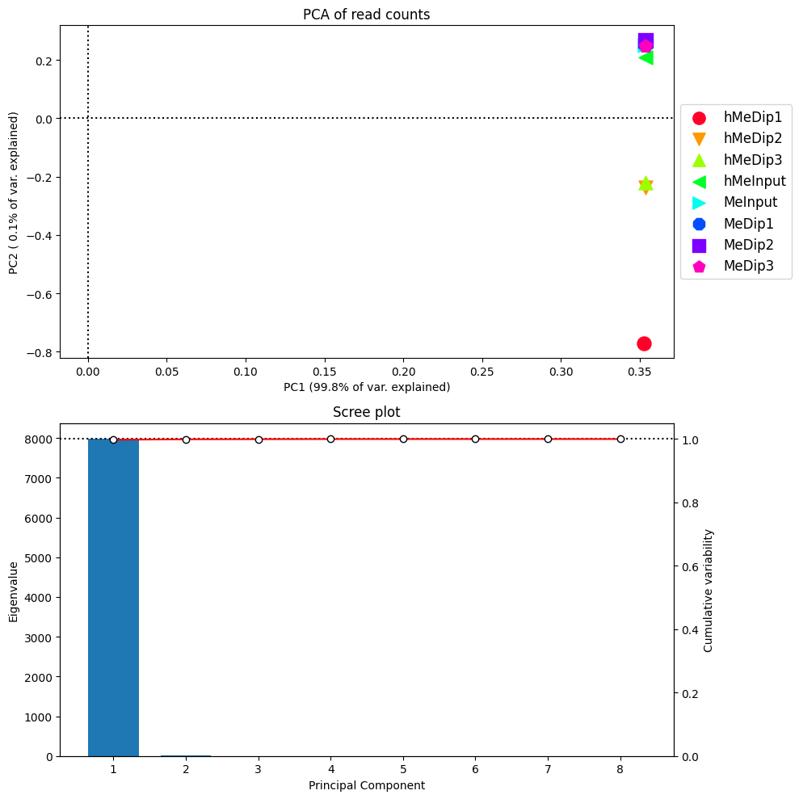

```{r setup, include=T, message=F}
#root.dir <- here::here()
knitr::opts_chunk$set(
  collapse = TRUE,
  comment = "#>",
  #root.dir = root.dir
  fig.height = 6,
  fig.width = 7.00787 #178mm
)  
knitr::opts_knit$set(#root.dir = root.dir, 
                     dpi = 350)  
library(data.table)
library(ggplot2)
library(tidyverse)
library(cowplot)
library(MEDIPS)
library(DiffBind)
library(BSgenome)
library(Rsamtools)
library(edgeR)
library(gtools)
library(DNAcopy)
library(rtracklayer)
library(viridis)
library(dplyr)
library(genomation)
library(biomaRt)
library(GenomicRanges)
library(DT)
library(magick)
library(patchwork)
library(slickR)
library(svglite)
#library(ggpubr)
```


## MEDIPS


#### Saturation analysis


```{r,echo=FALSE}
num_reads <- c(222798571,222798571,243011542,237866546,322441579,257337546,250971747,275296486)
maxTruCorr <- c(0.9999986, 0.9999986, 0.9999985, 0.9999939, 0.9999996, 0.9999996, 0.9999995, 0.9999947)
maxEstCorr <- c( 0.9999993, 0.9999993, 0.9999993, 0.9999969, 0.9999998, 0.9999998, 0.9999998, 0.9999973)
 names_list <- c("MeDip1","MeDip2","MeDip3","MedipInput",
                 "hMeDip1","hMeDip2","hMeDip3","hMeDipInput")
```


The saturation plots for MeDip data,


```{r, echo=FALSE, out.width = '29%', out.height = "39%",fig.show = 'hold', fig.align='center'}
slickR(c("Images/MEDIPS/MeDip/MeDip1_Saturation.png","Images/MEDIPS/MeDip/MeDip2_Saturation.png","Images/MEDIPS/MeDip/MeDip3_Saturation.png","Images/MEDIPS/MeDip/MeDipInput_Saturation.png")) %synch% (slickR(names_list[1:4],slideType = 'p'))


#knitr::include_graphics("~/Pictures/RBPFOX2.png")
```


And for hMeDip bam files,

```{r, echo=FALSE, out.width = '29%', out.height = "39%",fig.show = 'hold', fig.align='center'}
slickR(c("Images/MEDIPS/MeDip/hMeDip1_Saturation.png","Images/MEDIPS/MeDip/hMeDip2_Saturation.png","Images/MEDIPS/MeDip/hMeDip3_Saturation.png","Images/MEDIPS/MeDip/hMeDipInput_Saturation.png")) %synch% (slickR(names_list[5:8],slideType = 'p'))
#knitr::include_graphics("~/Pictures/RBPFOX2.png")
```


```{r}
df <- data.table(names_list,num_reads,maxEstCorr,maxTruCorr)
DT::datatable(df)
```


#### Sequence Pattern coverage


```{r, echo=FALSE, out.width = '29%', out.height = "39%",fig.show = 'hold', fig.align='center'}
slickR(c("Images/MEDIPS/MeDip/MeDip1_CoverageHist.png","Images/MEDIPS/MeDip/MeDip2_CoverageHist.png","Images/MEDIPS/MeDip/MeDip3_CoverageHist.png","Images/MEDIPS/MeDip/MeDipinput_CoverageHist.png")) %synch% (slickR(names_list[1:4],slideType = 'p'))
#knitr::include_graphics("~/Pictures/RBPFOX2.png")
```


**TAYCap**
```{r, echo=FALSE, out.width = '29%', out.height = "39%",fig.show = 'hold', fig.align='center'}
slickR(c("Images/MEDIPS/MeDip/hMeDip1_CoverageHist.png","Images/MEDIPS/MeDip/hMeDip2_CoverageHist.png","Images/MEDIPS/MeDip/hMeDip3_CoverageHist.png","Images/MEDIPS/MeDip/hMeDipInput_CoverageHist.png")) %synch% (slickR(names_list[5:8],slideType = 'p'))
#knitr::include_graphics("~/Pictures/RBPFOX2.png")
```


#### CpG Enrichment


```{r,echo=FALSE}
relH_enrich <- c(5.85616040043202,5.85616040043202,5.85074132767095,4.39643619795925,
                 5.59192926590715,5.49666359029923,5.57081088262585,4.39821883865697)

GoGe_enrich <- c(0.252936196338412,0.252936196338412,0.25272202285982,0.203816492544782,
                 0.25094174973812,0.247553825414661,0.250389957212048,0.203834741209848)
```


```{r}
df2 <- data.frame(names_list, relH_enrich,GoGe_enrich)
DT::datatable(df2)
```


### Running MEDIPS


The final results of the Differentially methylated regions determined
by using edgeR are as follows(selected with adjusted pvalue < 0.1)

```{r}
mr.edgeR.s.gain <- fread("MEDIPS_sig.tsv",header = T)
DT::datatable(mr.edgeR.s.gain[1:60,],options = list(scrollX=TRUE))
```


From here we extract the regions of interest:

```{r}
rois <- fread("rois_mbd.txt")
datatable(rois[1:100,] %>% column_to_rownames(var = "V1"))

```


## Deeptools plots

#### Correlation plots


```{r, echo=FALSE,fig.show = 'hold', fig.align='center'}

#knitr::include_graphics("/home/shashank.tiwari/Pictures/RBPFOX2.png")
```


```{r, echo=FALSE,fig.show = 'hold', fig.align='center'}

#knitr::include_graphics("/home/shashank.tiwari/Pictures/RBPFOX2.png")
```


#### Coverage Plots

```{r, echo=FALSE, out.width = '69%', out.height = "69%",fig.show = 'hold', fig.align='center'}
knitr::include_graphics(c("Images/deeptools/MeDip/Me_coverage.png", "Images/deeptools/MeDip/hMe_coverage.png"))
#knitr::include_graphics("/home/shashank.tiwari/Pictures/RBPFOX2.png")
```
 


#### PCA Plot


```{r, echo=FALSE,fig.show = 'hold', fig.align='center'}

#knitr::include_graphics("/home/shashank.tiwari/Pictures/RBPFOX2.png")
```


#### Fingerprint Plot


```{r, echo=FALSE, out.width = '49%', out.height = "39%",fig.show = 'hold', fig.align='center'}
knitr::include_graphics(c("Images/deeptools/MeDip/Me_fingerprint.png", "Images/deeptools/MeDip/hMe_fingerprint.png"))
#knitr::include_graphics("/home/shashank.tiwari/Pictures/RBPFOX2.png")
```


#### Plot profile


```{r, echo=FALSE, out.width = '29%', out.height = "19%",fig.show = 'hold', fig.align='center'}
slickR(c("Images/deeptools/MeDip/MeDip1_profile.png","Images/deeptools/MeDip/MeDip2_profile.png",
         "Images/deeptools/MeDip/MeDip3_profile.png")) %synch% (slickR(names_list[1:3],slideType = 'p'))
#knitr::include_graphics("~/Pictures/RBPFOX2.png")
```

**Next the combined plots in one axis**

```{r,echo=FALSE, fig.show='hold',fig.align='center', out.height="35%",out.width='29%'}
slickR(c("Images/deeptools/MeDip/MeDip_combined_profile.png",
         "Images/deeptools/MeDip/hMeDip_combined_profile.png")) %synch% (slickR(c("MeDip","hMeDip"), slideType = 'p'))

```


```{r, echo=FALSE, out.width = '29%', out.height = "19%",fig.show = 'hold', fig.align='center',eval=FALSE}
knitr::include_graphics(c("Images/deeptools/MeDip/hMeDip1_profile.png", "Images/deeptools/MeDip/hMeDip2_profile.png", "Images/deeptools/MeDip/hMeDip3_profile.png"))
#knitr::include_graphics("/home/shashank.tiwari/Pictures/RBPFOX2.png")
```


#### Heatmap


```{r, echo=FALSE, out.width = '29%', out.height = "29%",fig.show = 'hold', fig.align='center'}

slickR(c("Images/deeptools/MeDip/MeDip1_heatmap.png","Images/deeptools/MeDip/MeDip2_heatmap.png",
         "Images/deeptools/MeDip/MeDip3_heatmap.png")) %synch% (slickR(names_list[1:3],slideType = 'p'))
#knitr::include_graphics("~/Pictures/RBPFOX2.png")
```


## DiffBind


