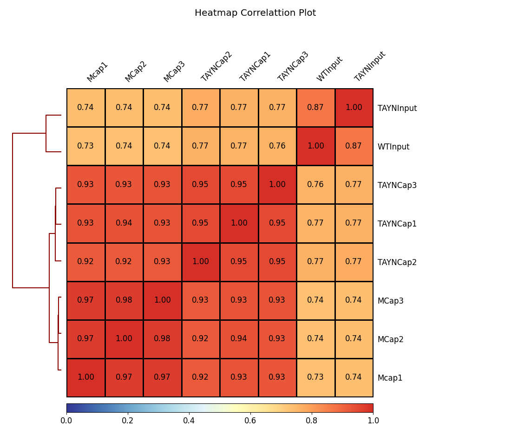
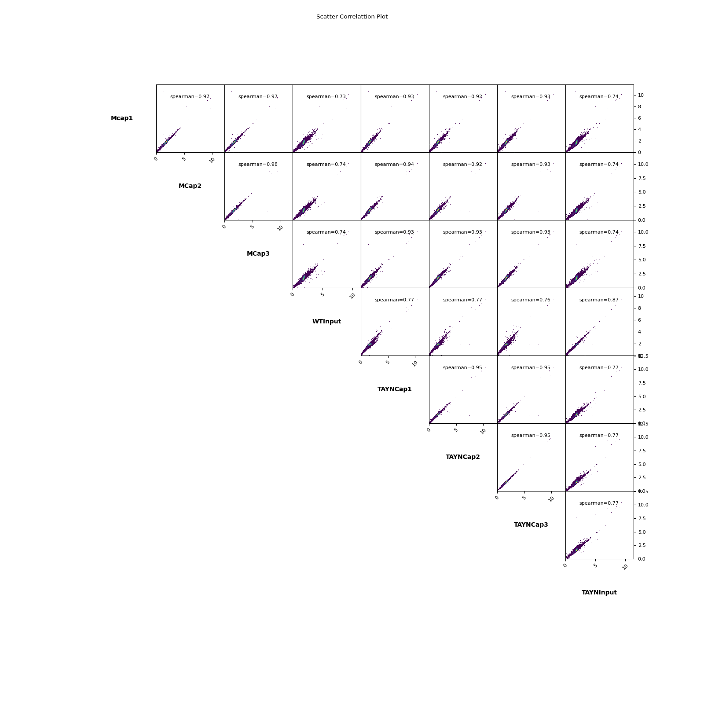
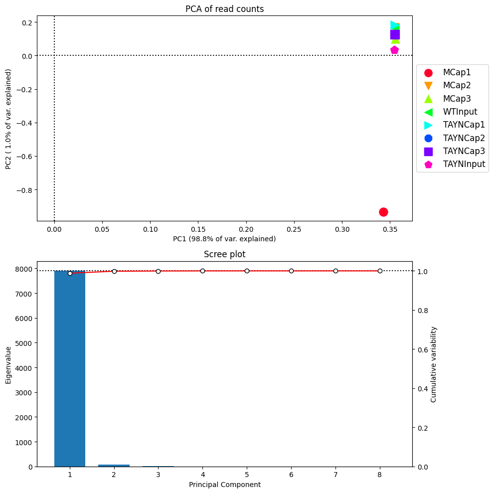
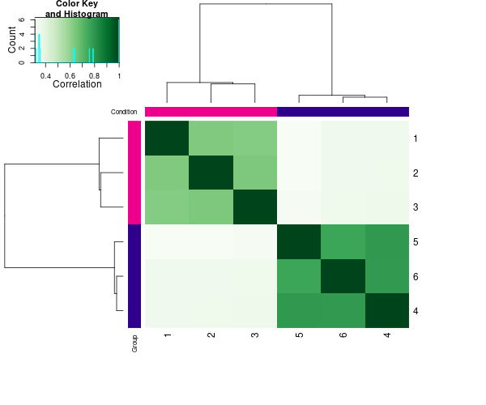
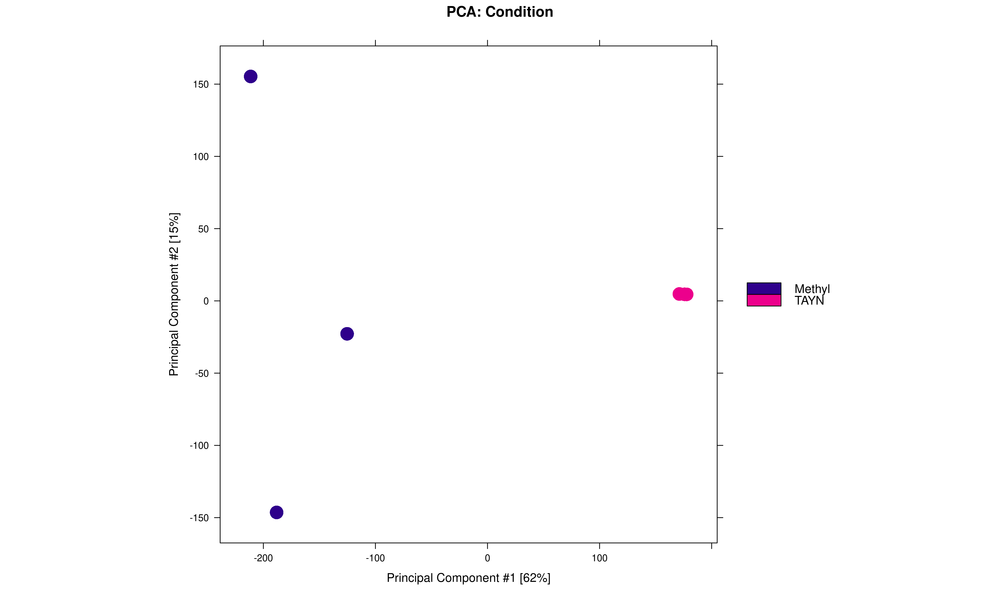
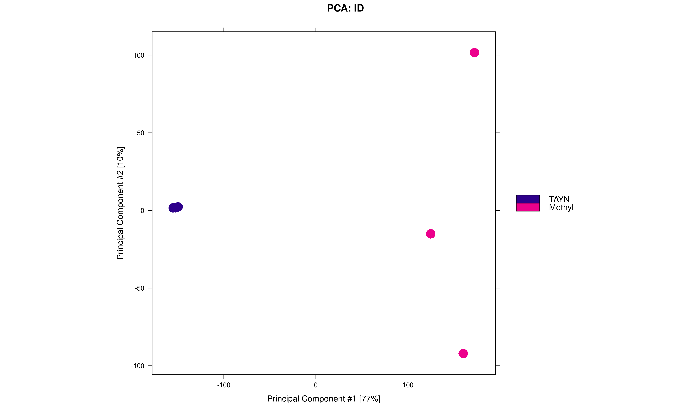
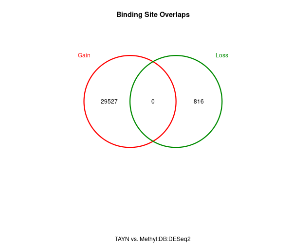
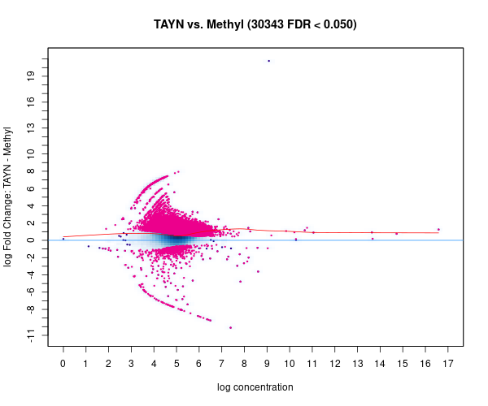
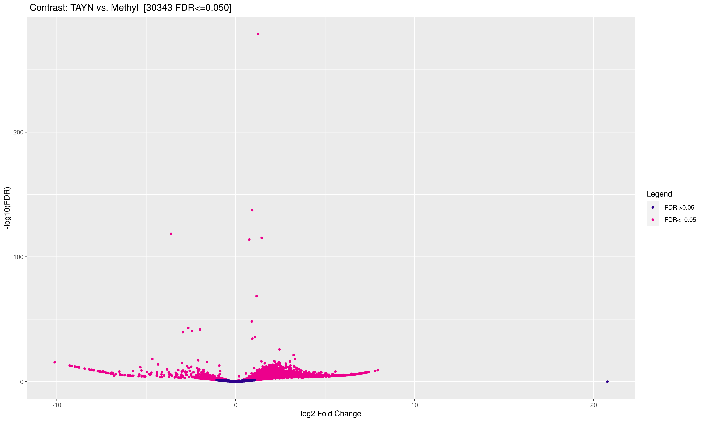
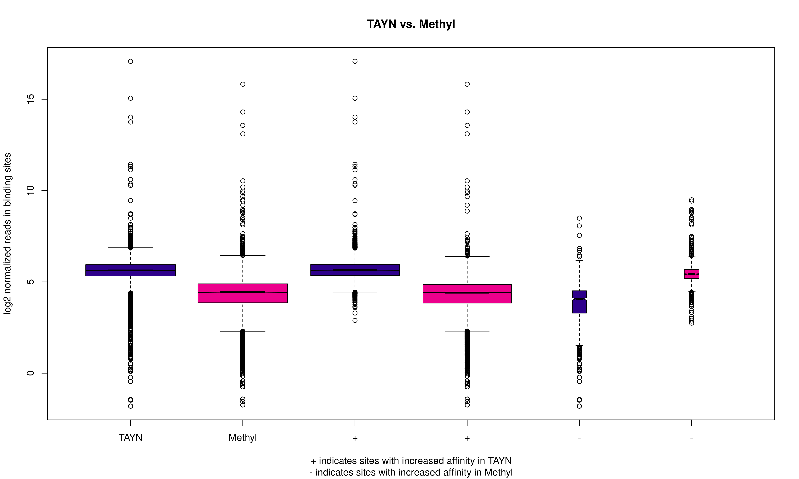

```{r setup, include=T, message=F}
#root.dir <- here::here()
knitr::opts_chunk$set(
  collapse = TRUE,
  comment = "#>",
  #root.dir = root.dir
  fig.height = 6,
  fig.width = 7.00787 #178mm
)  
knitr::opts_knit$set(#root.dir = root.dir, 
                     dpi = 350)  
library(data.table)
library(ggplot2)
library(tidyverse)
library(cowplot)
library(MEDIPS)
library(DiffBind)
library(BSgenome)
library(Rsamtools)
library(edgeR)
library(gtools)
library(DNAcopy)
library(rtracklayer)
library(viridis)
library(dplyr)
library(genomation)
library(biomaRt)
library(GenomicRanges)
library(DT)
library(magick)
library(patchwork)
library(slickR)
library(svglite)
#library(ggpubr)
```


## Cleaning and Preprocessing

The raw fastq files provided were first cleaned up using `trimgalore` to remove 
the adapters and low quality reads(`phredscore cutoff 20`) using the default parameters.
Next the reads were aligned to `GRCm38` using `bowtie`  on default settings.

The generated `sam` files were deduplicated and sorted before they were used for 
peak calling by `macs2`. We ran `macs2` with settings `--nomodel`and 
`--extsize 300` as suggested [here](https://manpages.ubuntu.com/manpages/impish/man1/macs2_callpeak.1.html)

The summary of peaks is as follows:

```{r}
df <- data.frame(c(11872,19814,15099,109375,80700,82972)
                 ,c("MethylRep1","MethylRep2","MethylRep3","TAYNRep1","TAYNRep2","TAYNRep3"))
colnames(df) <- c("No. of Peaks","Replicates")
DT::datatable(df, caption = "Peaks summay")
```


```{r}
df <- data.frame(c(244383927,303939487,266572321,357108714,284773719,277920034,297967032,257499466),c("MethylRep1","MethylRep2","MethylRep3","TAYNRep1","TAYNRep2","TAYNRep3","TAYN-Input","WT-Input"))
colnames(df) <- c("Number of reads","Replicate")
DT::datatable(df,caption = "Summary of read counts")
```

## Differential binding regions
After the peak calling we are interested in finding the regions which show a 
differential binding pattern. We decided to use the MEDIPS package. 
MEDIPS was developed for analyzing data derived from methylated DNA 
immunoprecipitation (MeDIP) experiments followed by sequencing (MeDIP-seq).
However, MEDIPS provides several functionalities for the analysis of
other kinds of quantitative sequencing data such as ChIPSeq, MBDSeq etc,i
ncluding calculation of differential coverage between groups of samples 
as well as saturation and correlation analyses.

In detail, MEDIPS adresses the following:
- estimating the reproducibility for obtaining full genome short read coverage profiles
- calculating genome wide signal densities at a user specified resolution
- calculating differential coverage comparing two groups of samples,
- correcting for copy number variations present in the genomic background samples 

In addition, MEDIPS provides the following MeDIP/MBD-seq specific functionalities:
- analyzing the coverage of genome wide DNA sequence patterns (e.g. CpGs)
- calculating a CpG enrichment factor as a quality control for MeDIP/MBD
  specific immunoprecipitation,
- plotting of calibration plots as a data quality check and for a visual 
  inspection of the dependency between local sequence pattern (e.g. CpG)
  densities and MeDIP/MBD signals,
- normalization of MeDIP-seq data with respect to local sequence pattern
  (e.g. CpG) densities (relative methylation score),

### Running MEDIPS

MEDIPS takes the input of bam files and provides methods for quality control. \

* *Saturation analysis* is used to identify given set of mapped reads is sufficient \
  to generate a saturated and reproducible coverage profile of the reference genome,
* Gives the output of estimated and trye correlation analysis. The main idea is that  \
  an insufficent number of short reads will not result in a saturated methylation profile. \
  Only if there is a sufficient number of short reads, the resulting genome wide coverage \
  profile will be reproducible by another independent set of a similar number of short reads. \
* *Sequence Pattern Coverage* used to test the number of CpGs covered by the given short
  read and the read depth coverage per CpG. \

* *CpG Enrichment* 


```{r,echo=FALSE}
num_reads <- c(222798571,222798571,243011542,237866546,322441579,257337546,250971747,275296486)
maxTruCorr <- c(0.9999986, 0.9999986, 0.9999985, 0.9999939, 0.9999996, 0.9999996, 0.9999995, 0.9999947)
maxEstCorr <- c( 0.9999993, 0.9999993, 0.9999993, 0.9999969, 0.9999998, 0.9999998, 0.9999998, 0.9999973)
 names_list <- c("MethylCap1","MethylCap2","MethylCap3","MethylInput",
                 "TAYNCap1","TAYNCap2","TAYNCap3","TAYNInput")
```


```{r,eval=FALSE}

rep1.bam <- "/scratch1/users/shashank.tiwari/MBDSeq/Bam/Methyl-Cap-1_fixed_sorted.bam"
rep2.bam <- "/scratch1/users/shashank.tiwari/MBDSeq/Bam/Methyl-Cap-1_fixed_sorted.bam"
rep3.bam <- "/scratch1/users/shashank.tiwari/MBDSeq/Bam/Methyl-Cap-3_fixed_sorted.bam"
input.bam <- "/scratch1/users/shashank.tiwari/MBDSeq/Bam/wt-input_fixed_sorted.bam"
#read in the mutant bams
mutant1.bam <- "/scratch1/users/shashank.tiwari/MBDSeq/Bam/TAYN-Cap-1_fixed_sorted.bam"
mutant2.bam <- "/scratch1/users/shashank.tiwari/MBDSeq/Bam/TAYN-Cap-2_fixed_sorted.bam"
mutant3.bam <- "/scratch1/users/shashank.tiwari/MBDSeq/Bam/TAYN-Cap-3_fixed_sorted.bam"
mutant.input <- "/scratch1/users/shashank.tiwari/MBDSeq/Bam/TAYN-input_fixed_sorted.bam"


#specify parameters
BSgenome = "BSgenome.Mmusculus.GRCm38"
uniq=TRUE
extend=300
shift=0
ws=150
chr.select=c(1:19,"X","Y","MT")

#saturation analysis
sr = MEDIPS.saturation(file = c(rep1.bam,rep2.bam,input.bam),BSgenome = BSgenome,
                       uniq = 0,extend = 300,
                       shift = 0, window_size = ws,
                        nit=10,nrit = 1,empty_bins = T,
                       rank = F)
#saturation plot
MEDIPS.plotSaturation(sr)
```


#### Summary of saturation analysis:


The saturation plots for wildtype data,


```{r, echo=FALSE, out.width = '29%', out.height = "39%",fig.show = 'hold', fig.align='center'}
slickR(c("Images/MEDIPS/MBD/MCap1_Saturation.png","Images/MEDIPS/MBD/MCap2_Saturation.png","Images/MEDIPS/MBD/MCap3_Saturation.png","Images/MEDIPS/MBD/MCapInput_Saturation.png")) %synch% (slickR(names_list[1:4],slideType = 'p'))


#knitr::include_graphics("~/Pictures/RBPFOX2.png")
```


And for TAYN Mutant bam files,

```{r, echo=FALSE, out.width = '29%', out.height = "39%",fig.show = 'hold', fig.align='center'}
slickR(c("Images/MEDIPS/MBD/TAYNCap1_Saturation.png","Images/MEDIPS/MBD/TAYNCap2_Saturation.png","Images/MEDIPS/MBD/TAYNCap3_Saturation.png","Images/MEDIPS/MBD/TAYNInput_Saturation.png")) %synch% (slickR(names_list[5:8],slideType = 'p'))
#knitr::include_graphics("~/Pictures/RBPFOX2.png")
```

The summary is as follows, Genome-wide coverage saturation analysis produced two values for each sample: the saturation correlation (maxTruCor) which is based on sequential calculations using half of the reads, and the estimated correlation (maxEstCor) which is based on artificially doubling that half. Actual correlation and reproducibility falls between the results of these true and estimated values. 


```{r}
df <- data.table(names_list,num_reads,maxEstCorr,maxTruCorr)
DT::datatable(df)
```


Further the next step is to perform sequenec pattern coverage analysis to determine
the number of CpGs and the depth of coverage per CpG.


```{r,eval=FALSE}
# pattern coverange 
cr = MEDIPS.seqCoverage(file = mutant1.bam, pattern = "CG",
                        BSgenome = BSgenome, chr.select = 10,
                        extend = extend, shift = shift, uniq = 0)

MEDIPS.plotSeqCoverage(seqCoverageObj = cr, type="pie",cov.level = c(30:45))

MEDIPS.plotSeqCoverage(seqCoverageObj = cr, type = "hist", t =45,
                       main = "Sequnce pattern Coverage")
```


```{r, echo=FALSE, out.width = '29%', out.height = "39%",fig.show = 'hold', fig.align='center'}
slickR(c("Images/MEDIPS/MBD/MCap1_CoverageHist.png","Images/MEDIPS/MBD/MCap2_CoverageHist.png","Images/MEDIPS/MBD/MCap3_CoverageHist.png","Images/MEDIPS/MBD/MCapinput_CoverageHist.png")) %synch% (slickR(names_list[1:4],slideType = 'p'))
#knitr::include_graphics("~/Pictures/RBPFOX2.png")
```


**TAYCap**
```{r, echo=FALSE, out.width = '29%', out.height = "39%",fig.show = 'hold', fig.align='center'}
slickR(c("Images/MEDIPS/MBD/TAYNCap1_CoverageHist.png","Images/MEDIPS/MBD/TAYNCap2_CoverageHist.png","Images/MEDIPS/MBD/TAYNCap3_CoverageHist.png","Images/MEDIPS/MBD/TAYNCapInput_CoverageHist.png")) %synch% (slickR(names_list[5:8],slideType = 'p'))
#knitr::include_graphics("~/Pictures/RBPFOX2.png")
```


The CpG enrichment checking is done in MEDIPS by testing the enrichment of CpGs within
the genomic regions covered by a given set of short reads compared to the full reference
genome. The final score is given by dividing the relative frequency of CpGs of the
regions by the relative frequency of CpGs of the reference genome.


```{r,eval=FALSE}
er = MEDIPS.CpGenrich(file = rep1.bam, BSgenome = BSgenome, chr.select = 1,
                      extend = extend, shift = shift, uniq = 0)


```


#### Summary of CpG enrichment

```{r,echo=FALSE}
relH_enrich <- c(5.85616040043202,5.85616040043202,5.85074132767095,4.39643619795925,
                 5.59192926590715,5.49666359029923,5.57081088262585,4.39821883865697)

GoGe_enrich <- c(0.252936196338412,0.252936196338412,0.25272202285982,0.203816492544782,
                 0.25094174973812,0.247553825414661,0.250389957212048,0.203834741209848)
```


```{r}
df2 <- data.frame(names_list, relH_enrich,GoGe_enrich)
DT::datatable(df2)
```


Lastly we run MEDIPS do find the differentially methylated regions, we give provide 
the input of MethylCap replicates and TAYNCap replicates along with the correspoding 
inputs. The final output received is the list of merged differentially methylated regions.


```{r,eval=FALSE}
# make MEDIPset for replicates and input

Methyl_rep1 = MEDIPS.createSet(file = rep1.bam, BSgenome = BSgenome,
                               extend = extend, shift = shift, uniq = 0,
                               window_size = ws, chr.select = chr.select)

Methyl_rep1 =c(Methyl_rep1,MEDIPS.createSet(file = rep2.bam, BSgenome = BSgenome,
                               extend = extend, shift = shift, uniq = 0,
                               window_size = ws, chr.select = chr.select))

Methyl_rep1 =c(Methyl_rep1,MEDIPS.createSet(file = rep3.bam, BSgenome = BSgenome,
                               extend = extend, shift = shift, uniq = 0,
                               window_size = ws, chr.select = chr.select))

Input_methyl = MEDIPS.createSet(file= input.bam, BSgenome=BSgenome,
                                extend = extend, shift = shift, uniq = 0,
                                window_size = ws, chr.select=chr.select)

# make MEDIPSet for Mutant type and input

Mutant_rep1 = MEDIPS.createSet(file=mutant1.bam, BSgenome = BSgenome,
                               extend = extend, shift = shift, uniq = 0,
                               window_size = ws, chr.select = chr.select)
Mutant_rep1 = c(Mutant_rep1, MEDIPS.createSet(file=mutant2.bam, BSgenome = BSgenome,
                               extend = extend, shift = shift, uniq = 0,
                               window_size = ws, chr.select = chr.select))
Mutant_rep1 = c(Mutant_rep1, MEDIPS.createSet(file=mutant3.bam, BSgenome = BSgenome,
                               extend = extend, shift = shift, uniq = 0,
                               window_size = ws, chr.select = chr.select))
Input_Mutant = MEDIPS.createSet(file=mutant.input, BSgenome = BSgenome,
                               extend = extend, shift = shift, uniq = 0,
                               window_size = ws, chr.select = chr.select)
#generate a coupling set
CS = MEDIPS.couplingVector(pattern = "CG", refObj = Mutant_rep1[[1]])


# coverage and edgeR analysis

mr.edgeR = MEDIPS.meth(MSet1 = Methyl_rep1, MSet2 = Mutant_rep1,
                       CSet = CS, ISet1 = Input_methyl, ISet2 = Input_Mutant, p.adj = "bonferroni",
                       diff.method = "edgeR", MeDIP = T,
                       CNV = T, minRowSum = 1)

#find significant regions
mr.edgeR.s = MEDIPS.selectSig(results = mr.edgeR, p.value = 0.1,
                              adj = T, ratio = NULL, bg.counts = NULL, CNV = F)
# merge neighbors

mr.edgeR.s.gain = mr.edgeR.s[which(mr.edgeR.s[,grep("logFC",colnames(mr.edgeR.s))] <0),]
mr.edgeR.s.gain.m = MEDIPS.mergeFrames(frames = mr.edgeR.s.gain, distance = 0)
# regions of interest

rois = MEDIPS.selectROIs(results = mr.edgeR,rois = mr.edgeR.s.gain.m,
                         columns = "counts", summarize = NULL)

#calibration plot
#MEDIPS.plotCalibrationPlot(CSet = CS, main = "CalibrationPlot",
#                           MSet = Mutant_rep1[[2]], plot_chr = "1", xrange = T)

#correlation of medips set
cor.matrix = MEDIPS.correlation(MSets = c(Methyl_rep1, Mutant_rep1, Input_methyl, Input_Mutant))
```

The final results of the Differentially methylated regions determined
by using edgeR are as follows(selected with adjusted pvalue < 0.1)

```{r}
mr.edgeR.s.gain <- fread("MEDIPS_sig.tsv",header = T)
DT::datatable(mr.edgeR.s.gain[1:60,],options = list(scrollX=TRUE))
```

From here we extract the regions of interest:

```{r}
rois <- fread("rois_mbd.txt")
datatable(rois[1:100,] %>% column_to_rownames(var = "V1"))

```


The list shows only the first few items from the list since the size is too large, 
in total `39825` DMRs are detected by MEDIPS.


The same analysis for MeDip and hMeDip data can be found [here]()

## Deeptools

I also attempted to do QC checks on the bam files and generate heatmaps for 
the binding regions of the peaks detected by `MACS2` using `deeptools`. \
deepTools is a suite of python tools particularly developed for the efficient analysis 
of high-throughput sequencing data, such as ChIP-seq, RNA-seq or MNase-seq. We used this 
tool to calculate coverage and generate profile and heatmap plots


### BamCoverage
This tool takes an alignment of reads or fragments as input (BAM file) and generates a 
coverage track (bigWig or bedGraph) as output. The coverage is calculated as the number of
reads per bin, where bins are short consecutive counting windows of a defined size. We define 
a bin size of 10 and normalize using Reads Per Kilobase per Million mapped reads (RPKM). The 
output is stored as bigwig files which can be found [here](https://owncloud.gwdg.de/index.php/s/jFriwPQHyMdwNvy)

These bigwig files are used as the input for `multiBigwigSummary`, which computes the average scores
for each of the files in every genomic region. The output generated in a compressed numpy array(.npz) 
which is used to generate Correlation and PCA plots.

#### Correlation plot

```{r, echo=FALSE,fig.show = 'hold', fig.align='center'}

#knitr::include_graphics("/home/shashank.tiwari/Pictures/RBPFOX2.png")
```


```{r, echo=FALSE,fig.show = 'hold', fig.align='center'}

#knitr::include_graphics("/home/shashank.tiwari/Pictures/RBPFOX2.png")
```


First we generate the plots to compare amongst the replicates, the correlation is calculated using 
`plotCoverage` function with Spearman's method and heatmap and scatter plots are generated.


#### Coverageplots


```{r, echo=FALSE, out.width = '49%', out.height = "39%",fig.show = 'hold', fig.align='center'}
knitr::include_graphics(c("Images/deeptools/MBD/Methyl_coverage.png", "Images/deeptools/MBD/TAYN_coverage.png"))
#knitr::include_graphics("/home/shashank.tiwari/Pictures/RBPFOX2.png")
```
 

Next we get the PCA plots using the `plotPCA` function. Principal component analysis (PCA) 
can be used to determine whether samples display greater variability between experimental
conditions than between replicates of the same treatment. PCA is also useful to identify 
unexpected patterns, such as those caused by batch effects or outliers. Principal components
represent the directions along which the variation in the data is maximal, so that the 
information (e.g., read coverage values) from thousands of regions can be represented by
just a few dimensions.


#### PCA Plots

```{r, echo=FALSE,fig.show = 'hold', fig.align='center'}

#knitr::include_graphics("/home/shashank.tiwari/Pictures/RBPFOX2.png")
```


Further we generate the coverage plot to calculate what percentage of reads

Lastly we use the `plotFingerprint` function to generate the fingerprint plots


```{r, echo=FALSE, out.width = '49%', out.height = "39%",fig.show = 'hold', fig.align='center'}
knitr::include_graphics(c("Images/deeptools/MBD/Methyl_fingerprint.png", "Images/deeptools/MBD/TAYN_fingerprint.png"))
#knitr::include_graphics("/home/shashank.tiwari/Pictures/RBPFOX2.png")
```

It determines how well the signal in the sample can be differentiated from the background distribution of reads in the control sample. An ideal input with perfect uniform distribution of reads along the genome (i.e. without enrichments ) and infinite sequencing coverage should generate a straight diagonal line. A very specific and strong enrichment will be indicated by a prominent and steep rise of the cumulative sum towards the highest rank. This means that a big chunk of reads from the  sample is located in few bins which corresponds to high. Our plots indicate that it is more difficult to distinguish between input and sample, however it does not mean that the experiment has failed.

### PlotProfile

The next step is to generate profile plot, however as a prerequisite we need to 
generate a matrix which contains scores per genome region and can be used as an 
input for generating heatmap and profile plot.

The plot contains the scores over the peaks regions for the bigwig file.

```{r, echo=FALSE, out.width = '29%', out.height = "19%",fig.show = 'hold', fig.align='center'}
slickR(c("Images/deeptools/MBD/MCap1_profile.png","Images/deeptools/MBD/MCap2_profile.png",
         "Images/deeptools/MBD/MCap3_profile.png")) %synch% (slickR(names_list[1:3],slideType = 'p'))
#knitr::include_graphics("~/Pictures/RBPFOX2.png")
```

**Next the heatmaps**


```{r, echo=FALSE, out.width = '29%', out.height = "29%",fig.show = 'hold', fig.align='center'}

slickR(c("Images/deeptools/MBD/MCap1_heatmap.png","Images/deeptools/MBD/MCap2_heatmap.png",
         "Images/deeptools/MBD/MCap3_heatmap.png")) %synch% (slickR(names_list[1:3],slideType = 'p'))
#knitr::include_graphics("~/Pictures/RBPFOX2.png")
```

```{r, echo=FALSE, out.width = '29%', out.height = "19%",fig.show = 'hold', fig.align='center',eval=FALSE}
knitr::include_graphics(c("Images/deeptools/MBD/TAYNCap1_profile.png", "Images/deeptools/MBD/TAYNCap2_profile.png", "Images/deeptools/MBD/TAYNCap3_profile.png"))
#knitr::include_graphics("/home/shashank.tiwari/Pictures/RBPFOX2.png")
```

### Heatmaps

```{r, echo=FALSE, out.width = '29%', out.height = "19%",fig.show = 'hold', fig.align='center'}

slickR(c("Images/deeptools/MBD/TAYNCap1_profile.png","Images/deeptools/MBD/TAYNCap2_profile.png",
         "Images/deeptools/MBD/TAYNCap3_profile.png")) %synch% (slickR(names_list[6:8],slideType = 'p'))
#knitr::include_graphics("~/Pictures/RBPFOX2.png")
```

**and now the heatmaps**


```{r, echo=FALSE, out.width = '29%', out.height = "29%",fig.show = 'hold', fig.align='center'}

slickR(c("Images/deeptools/MBD/TAYNCap1_heatmap.png","Images/deeptools/MBD/TAYNCap2_heatmap.png",
         "Images/deeptools/MBD/TAYNCap3_heatmap.png")) %synch% (slickR(names_list[6:8],slideType = 'p'))
#knitr::include_graphics("~/Pictures/RBPFOX2.png")
```


```{r, echo=FALSE, out.width = '29%', out.height = "29%",fig.show = 'hold', fig.align='center',eval=FALSE}
knitr::include_graphics(c("Images/deeptools/MBD/MCap1_heatmap.png", "Images/deeptools/MBD/MCap2_heatmap.png", "Images/deeptools/MBD/MCap3_heatmap.png"))
#knitr::include_graphics("/home/shashank.tiwari/Pictures/RBPFOX2.png")
```


```{r, echo=FALSE, out.width = '29%', out.height = "29%",fig.show = 'hold', fig.align='center',eval=FALSE}
knitr::include_graphics(c("Images/deeptools/MBD/TAYNCap1_heatmap.png", "Images/deeptools/MBD/TAYNCap2_heatmap.png", "Images/deeptools/MBD/TAYNCap3_heatmap.png"))
#knitr::include_graphics("/home/shashank.tiwari/Pictures/RBPFOX2.png")
```


The plot is a heatmap for scores associated with genomic regions, which in our case are the peaks called by `MACS2`.


## DiffBind

An alternative to MEDIPS was to use the `DiffBind` package which was developed for 
detecting differetial binding sites for ChipSeq data. The required input for Diffbind
is the bam files and the peaks called by `MACS2`. The primary emphasis of the package 
is on identifying sites that are differentially bound between sample groups. It
includes functions to support the processing of peak sets, including overlapping
and merging peak sets, counting sequencing reads overlapping intervals in peak sets,
and identifying statistically significantly differentially bound sites based on 
evidence of binding affinity (measured by differences in read densities). 


### Running DiffBind

The input given here is the list of the peaks generated by `MACS2` and the bam files 
along with the input control files for both MethylCap and TAYNCap. Once the peak files 
are read, a consensus peakset is generated based on the replicates provided for each sample. 
Next the peaks are centered and trimmed and a counts matrix is generated based on 
how many reads overlap each interval for unique samples


```{r,eval=FALSE}
library(DiffBind)

#setwd("Me-Dip/")

samples <- read.csv("Sample-Sheet_2.csv")
samples
#Sample-Sheet_2.csv
DBdata <- dba(sampleSheet = samples)

#DBdata

#plot(DBdata)

DBdata <- dba.count(DBdata,summits = 250, bUseSummarizeOverlaps=TRUE)
#plot()

DBdata <- dba.contrast(DBdata,categories = DBA_CONDITION,minMembers = 2)

DBdata <- dba.analyze(DBdata)

DBdata_all <- dba.analyze(DBdata,method = DBA_ALL_METHODS)


plot1 <- dba.plotVolcano(DBdata)
tiff("Figures/Volcano.tiff",width = 35,height = 21,units = 'cm',res = 300)
plot(plot1)
dev.off()
plot2 <- dba.plotPCA(DBdata)
tiff("Figures/PCA_C.tiff",width = 35,height = 21,units = 'cm',res = 300)
plot(plot2)
dev.off()
plot3 <- dba.plotPCA(DBdata,contrast = 1)
tiff("Figures/PCA_ID_2.tiff",width = 35,height = 21,units = 'cm',res = 300)
plot(plot3)
dev.off()
plot4 <- dba.plotBox(DBdata) 
tiff("Figures/BoxPlot.tiff",width = 35,height = 21,units = 'cm',res = 300)
plot(plot4)
dev.off()
#dba.plotProfile(DBdata)
profiles <- dba.plotProfile(DBdata)
dba.plotProfile(profiles)

report <- dba.report(DBdata,method = DBA_DESEQ2)
report <- as.data.frame(report)
```

Show and plot the results:
```{r}
report <- fread("Dfbind_report.tsv")
datatable(report[1:200,],options = list(scrollX=TRUE))

```

The plots generated are as follows, first we look at the heatmap to see the correlation 
between the replicates and different samples, where 1,2,3 are MethylCap1, MethylCap2 and 
MethylCap3 and 4,5,6 are TAYNCap1, TAYNCap2 and TAYNCap3 respectively

```{r, echo=FALSE,fig.show = 'hold', fig.align='center'}

#knitr::include_graphics("/home/shashank.tiwari/Pictures/RBPFOX2.png")
```

* Next we plot the PCA plot to give a deeper insight into how the samples are correlated
```{r, echo=FALSE,fig.show = 'hold', fig.align='center'}

#knitr::include_graphics("/home/shashank.tiwari/Pictures/RBPFOX2.png")
```
We can also get the plot for only the differentailly bound sites


```{r, echo=FALSE,fig.show = 'hold', fig.align='center'}

#knitr::include_graphics("/home/shashank.tiwari/Pictures/RBPFOX2.png")
```

 * Next we plot a venndiagram to to illlustrate the overlaps between different sets of peaks. Here Gain represents an increased \   enrichment and Loss stands for a lower enrichment.
 


```{r, echo=FALSE,fig.show = 'hold', fig.align='center'}

#knitr::include_graphics("/home/shashank.tiwari/Pictures/RBPFOX2.png")
```
 
 
 MA plots are a useful way to visualize the relationship between the overall binding level at
each site and the magnitude of the change in binding enrichment between conditions, as well
as the effect of normalization on data.

```{r, echo=FALSE,fig.show = 'hold', fig.align='center'}

#knitr::include_graphics("/home/shashank.tiwari/Pictures/RBPFOX2.png")
```

Each point represents a binding site, with the points
in magenta representing sites identified as differentially bound. There is a blue horizontal
line through the origin (0 LFC), as well as a horizontal red curve representing a non-linear
loess fit showing the underlying relationship between coverage levels and fold changes. The
plot shows how the differentially bound sites appear to have a minimum absolute log fold
difference of somewhere between one and two \\


Similar to MA plots, Volcano plots also highlight significantly differentially bound sites and
show their fold changes. Here, however, the confidence statistic (FDR or p-value) is shown on
a negative log scale, helping visualize the relationship between the magnitude of fold changes
and the confidence that sites are differentially bound


```{r, echo=FALSE,fig.show = 'hold', fig.align='center'}

#knitr::include_graphics("/home/shashank.tiwari/Pictures/RBPFOX2.png")
```


Boxplots provide a way to view how read distributions differ between classes of binding sites.


```{r, echo=FALSE,fig.show = 'hold', fig.align='center'}

#knitr::include_graphics("/home/shashank.tiwari/Pictures/RBPFOX2.png")
```


The default plot shows in the first two boxes that amongst differentially bound sites
overall, the TAYN samples have a somewhat higher mean read concentration. The next
two boxes show the distribution of reads in differentially bound sites that exhibit increased
affinity in the TAYN samples, while the final two boxes show the distribution of reads in
differentially bound sites that exhibit increased affinity in the MEthylCap samples.